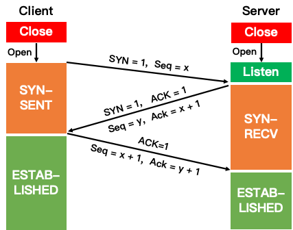

# 计算机网络常见面试题

## 1. OSI 与 TCP / IP 各层的结构与功能，有哪些协议？

学习计算机网络时我们一般采用折中的办法，也就是中和 OSI 和 TCP/IP 的优点，采用一种只有五层协议的体系结构，这样既简洁又能将概念阐述清楚。

结合互联网的情况，自上而下地，非常简要的介绍一下各层的作用

### 1.1 应用层

应用层（application-layer）的任务是通过应用进程间的交互来完成特定网络应用。应用层协议定义的是应用进程（进程：主机中正在运行的程序）间的通信与交互的规则。对于不同的网络应用需要不同的应用层协议。在互联网中应用层协议很多，如域名系统 DNS，支持万维网应用的 HTTP 协议，支持电子邮件的 SMTP 协议等等。我们把应用层交互的数据单元称为报文。

**域名系统**

> 域名系统(Domain Name System 缩写 DNS，Domain Name 被译为域名)是因特网的一项核心服务，它作为可以将域名和 IP 地址相互映射的一个分布式数据库，能够使人更方便的访问互联网，而不用去记住能够被机器直接读取的 IP 数串。（百度百科）例如：一个公司的 Web 网站可看作是它在网上的门户，而域名就相当于其门牌地址，通常域名都使用该公司的名称或简称。例如上面提到的微软公司的域名，类似的还有：IBM 公司的域名是 www.ibm.com、Oracle 公司的域名是 www.oracle.com、Cisco 公司的域名是 www.cisco.com 等。

**HTTP 协议**

> 超文本传输协议（HTTP，HyperText Transfer Protocol)是互联网上应用最为广泛的一种网络协议。所有的 WWW（万维网） 文件都必须遵守这个标准。设计 HTTP 最初的目的是为了提供一种发布和接收 HTML 页面的方法。（百度百科）

### 1.2 运输层

**运输层（transport layer）的主要任务就是负责向两台主机进程之间的通信提供通用的数据传输服务。**应用进程利用该服务传送应用层报文。“通用的”是指并不针对某一个特定的网络应用，而是多种应用可以使用同一个运输层服务。由于一台主机可同时运行多个线程，因此运输层有复用和分用的功能。所谓复用就是指多个应用层进程可同时使用下面运输层的服务，分用和复用相反，是运输层把收到的信息分别交付上面应用层中的相应进程。

**运输层主要使用以下两种协议:**

1. **传输控制协议 TCP**（Transmission Control Protocol）--提供**面向连接**的，**可靠的**数据传输服务。
2. **用户数据协议 UDP**（User Datagram Protocol）--提供**无连接**的，尽最大努力的数据传输服务（**不保证数据传输的可靠性**）。

**TCP 与 UDP 的对比见问题三。**

### 1.3 网络层

**在计算机网络中进行通信进行通信的两个计算机之间可能会经过很多个数据链路，也可能还要经过很多通信子网。网络层的任务就是选择合适的网间路由和交换节点，确保数据的及时传送。**在发送数据时，网络层把运输层产生的报文段或用户数据报封装成分组和包进行传送。在 TCP/IP 体系结构中，由于网络层使用 IP 协议，因此也叫 IP 数据报，简称 数据报。

这里需要注意：**不要把运输层的“用户数据报 UDP” 和网络层的“IP 数据报”弄混淆**。另外，无论是哪一层的数据单元，都可以笼统的“分组”来表示。

这里强调指出，网络层中的“网络”二字已经不是我们通常谈到的具体网络，而是指计算机网络体系结构模型中第三层的名称.

互联网是由大量的异构（heterogeneous）网络通过路由器（router）相互连接起来的。互联网使用的网络层协议是无连接的网际协议（Internet Protocol）和许多路由选择协议，因此互联网的网络层也叫做**网际层**或**IP 层**。

### 1.4 数据链路层

**数据链路层(data link layer)通常简称为链路层。两台主机之间的数据传输，总是在一段一段的链路上传送的，这就需要使用专门的链路层的协议。** 在两个相邻节点之间传送数据时，**数据链路层将网络层交下来的 IP 数据报组装成帧**，在两个相邻节点间的链路上传送帧。每一帧包括数据和必要的控制信息（如同步信息，地址信息，差错控制等）。

在接收数据时，控制信息使接收端能够知道一个帧从哪个比特开始和到哪个比特结束。这样，数据链路层在收到一个帧后，就可从中提出数据部分，上交给网络层。 控制信息还使接收端能够检测到所收到的帧中有无差错。如果发现差错，数据链路层就简单地丢弃这个出了差错的帧，以避免继续在网络中传送下去白白浪费网络资源。如果需要改正数据在链路层传输时出现差错（这就是说，数据链路层不仅要检错，而且还要纠错），那么就要采用可靠性传输协议来纠正出现的差错。这种方法会使链路层的协议复杂些。

### 1.5 物理层

在物理层上所传送的数据单位是比特。

**物理层(physical layer)的作用是实现相邻计算机节点之间比特流的透明传送，尽可能屏蔽掉具体传输介质和物理设备的差异，** 使其上面的数据链路层不必考虑网络的具体传输介质是什么。“透明传送比特流”表示经实际电路传送后的比特流没有发生变化，对传送的比特流来说，这个电路好像是看不见的。

在互联网使用的各种协议中最重要和最著名的就是 TCP/IP 两个协议。现在人们经常提到的 TCP/IP 并不一定单指 TCP 和 IP 这两个具体的协议，而往往表示互联网所使用的整个 TCP/IP 协议族。

### 1.6 总结

## 2. TCP 三次握手和四次回收（异常重要）

为了准确无误地把数据送达目标处，TCP 协议采用了三次握手策略。

### 2.1 TCP 三次握手图解

- 客户端–发送带有 SYN 标志的数据包–一次握手–服务端
- 服务端–发送带有 SYN/ACK 标志的数据包–二次握手–客户端
- 客户端–发送带有带有 ACK 标志的数据包–三次握手–服务端

**详细：**

三次握手是 TCP 连接的建立过程。在握手之前，主动打开连接的客户端结束 CLOSE 阶段，被动打开的服务器也结束 CLOSE 阶段，并进入 LISTEN 阶段。随后进入三次握手阶段：

① 首先客户端向服务器发送一个 SYN 包，并等待服务器确认，其中：

标志位为 SYN，表示请求建立连接；
序号为 Seq = x（x 一般取随机数）；
随后客户端进入 SYN-SENT 阶段。
② 服务器接收到客户端发来的 SYN 包后，对该包进行确认后结束 LISTEN 阶段，并返回一段 TCP 报文，其中：

标志位为 SYN 和 ACK，表示确认客户端的报文 Seq 序号有效，服务器能正常接收客户端发送的数据，并同意创建新连接；
序号为 Seq = y；
确认号为 Ack = x + 1，表示收到客户端的序号 Seq 并将其值加 1 作为自己确认号 Ack 的值，随后服务器端进入 SYN-RECV 阶段。
③ 客户端接收到发送的 SYN + ACK 包后，明确了从客户端到服务器的数据传输是正常的，从而结束 SYN-SENT 阶段。并返回最后一段报文。其中：

标志位为 ACK，表示确认收到服务器端同意连接的信号；
序号为 Seq = x + 1，表示收到服务器端的确认号 Ack，并将其值作为自己的序号值；
确认号为 Ack= y + 1，表示收到服务器端序号 seq，并将其值加 1 作为自己的确认号 Ack 的值。
随后客户端进入 ESTABLISHED。
当服务器端收到来自客户端确认收到服务器数据的报文后，得知从服务器到客户端的数据传输是正常的，从而结束 SYN-RECV 阶段，进入 ESTABLISHED 阶段，从而完成三次握手。

### 2.2 为什么要三次握手

**三次握手的目的是建立可靠的通信信道，说到通讯，简单来说就是数据的发送与接收，而三次握手最主要的目的就是双方确认自己与对方的发送与接收是正常的。**

第一次握手：Client 什么都不能确认；Server 确认了对方发送正常，自己接收正常

第二次握手：Client 确认了：自己发送、接收正常，对方发送、接收正常；Server 确认了：对方发送正常，自己接收正常

第三次握手：Client 确认了：自己发送、接收正常，对方发送、接收正常；Server 确认了：自己发送、接收正常，对方发送、接收正常

所以三次握手就能确认双发收发功能都正常，缺一不可。

### 2.3 第 2 次握手传回了 ACK，为什么还要传回 SYN？

接收端传回发送端所发送的 ACK 是为了告诉客户端，我接收到的信息确实就是你所发送的信号了，这表明从客户端到服务端的通信是正常的。而回传 SYN 则是为了建立并确认从服务端到客户端的通信。” 

> SYN 同步序列编号(Synchronize Sequence Numbers) 是 TCP/IP 建立连接时使用的握手信号。在客户机和服务器之间建立正常的 TCP 网络连接时，客户机首先发出一个 SYN 消息，服务器使用 SYN-ACK 应答表示接收到了这个消息，最后客户机再以 ACK(Acknowledgement）消息响应。这样在客户机和服务器之间才能建立起可靠的 TCP 连接，数据才可以在客户机和服务器之间传递。

### 2.4 为什么要四次挥手

**简易：**

- 客户端-发送一个 FIN，用来关闭客户端到服务器的数据传送
- 服务器-收到这个 FIN，它发回一 个 ACK，确认序号为收到的序号加 1 。和 SYN 一样，一个 FIN 将占用一个序号
- 服务器-关闭与客户端的连接，发送一个 FIN 给客户端
- 客户端-发回 ACK 报文确认，并将确认序号设置为收到序号加 1

**详细：**

四次挥手即 TCP 连接的释放，这里假设客户端主动释放连接。在挥手之前主动释放连接的客户端结束 ESTABLISHED 阶段，随后开始四次挥手：

① 首先客户端向服务器发送一段 TCP 报文表明其想要释放 TCP 连接，其中：

标记位为 FIN，表示请求释放连接；
序号为 Seq = u；
随后客户端进入 FIN-WAIT-1 阶段，即半关闭阶段，并且停止向服务端发送通信数据。
② 服务器接收到客户端请求断开连接的 FIN 报文后，结束 ESTABLISHED 阶段，进入 CLOSE-WAIT 阶段并返回一段 TCP 报文，其中：

标记位为 ACK，表示接收到客户端释放连接的请求；
序号为 Seq = v；
确认号为 Ack = u + 1，表示是在收到客户端报文的基础上，将其序号值加 1 作为本段报文确认号 Ack 的值；
随后服务器开始准备释放服务器端到客户端方向上的连接。
客户端收到服务器发送过来的 TCP 报文后，确认服务器已经收到了客户端连接释放的请求，随后客户端结束 FIN-WAIT-1 阶段，进入 FIN-WAIT-2 阶段。

③ 服务器端在发出 ACK 确认报文后，服务器端会将遗留的待传数据传送给客户端，待传输完成后即经过 CLOSE-WAIT 阶段，便做好了释放服务器端到客户端的连接准备，再次向客户端发出一段 TCP 报文，其中：

标记位为 FIN 和 ACK，表示已经准备好释放连接了；
序号为 Seq = w；
确认号 Ack = u + 1，表示是在收到客户端报文的基础上，将其序号 Seq 的值加 1 作为本段报文确认号 Ack 的值。
随后服务器端结束 CLOSE-WAIT 阶段，进入 LAST-ACK 阶段。并且停止向客户端发送数据。

④ 客户端收到从服务器发来的 TCP 报文，确认了服务器已经做好释放连接的准备，于是结束 FIN-WAIT-2 阶段，进入 TIME-WAIT 阶段，并向服务器发送一段报文，其中：

标记位为 ACK，表示接收到服务器准备好释放连接的信号；
序号为 Seq= u + 1，表示是在已收到服务器报文的基础上，将其确认号 Ack 值作为本段序号的值；
确认号为 Ack= w + 1，表示是在收到了服务器报文的基础上，将其序号 Seq 的值作为本段报文确认号的值。
随后客户端开始在 TIME-WAIT 阶段等待 2 MSL。服务器端收到从客户端发出的 TCP 报文之后结束 LAST-ACK 阶段，进入 CLOSED 阶段。由此正式确认关闭服务器端到客户端方向上的连接。客户端等待完 2 MSL 之后，结束 TIME-WAIT 阶段，进入 CLOSED 阶段，由此完成「四次挥手」。

任何一方都可以在数据传送结束后发出连接释放的通知，待对方确认后进入半关闭状态。当另一方也没有数据再发送的时候，则发出连接释放通知，对方确认后就完全关闭了 TCP 连接。

举个例子：A 和 B 打电话，通话即将结束后，A 说“我没啥要说的了”，B 回答“我知道了”，但是 B 可能还会有要说的话，A 不能要求 B 跟着自己的节奏结束通话，于是 B 可能又巴拉巴拉说了一通，最后 B 说“我说完了”，A 回答“知道了”，这样通话才算结束。

## 3. TCP，UDP 协议的区别

UDP 在传送数据之前不需要先建立连接，远地主机在收到 UDP 报文后，不需要给出任何确认。虽然 UDP 不提供可靠交付，但在某些情况下 UDP 却是一种最有效的工作方式（一般用于即时通信），比如： QQ 语音、 QQ 视频 、直播等等 

TCP 提供面向连接的服务。在传送数据之前必须先建立连接，数据传送结束后要释放连接。 TCP 不提供广播或多播服务。由于 TCP 要提供可靠的，面向连接的传输服务（TCP 的可靠体现在 TCP 在传递数据之前，会有三次握手来建立连接，而且在数据传递时，有确认、窗口、重传、拥塞控制机制，在数据传完后，还会断开连接用来节约系统资源），这一难以避免增加了许多开销，如确认，流量控制，计时器以及连接管理等。这不仅使协议数据单元的首部增大很多，还要占用许多处理机资源。TCP 一般用于文件传输、发送和接收邮件、远程登录等场景。

## 4. TCP 是如何保证可靠传输的？

1. 应用数据被分割成 TCP 认为最适合发送的数据块。
2. TCP 给发送的每一个包进行编号，接收方对数据包进行排序，把有序数据传送给应用层。
3. **校验和：** TCP 将保持它首部和数据的检验和。这是一个端到端的检验和，目的是检测数据在传输过程中的任何变化。如果收到段的检验和有差错，TCP 将丢弃这个报文段和不确认收到此报文段。
4. TCP 的接收端会丢弃重复的数据。
5. **流量控制：** TCP 连接的每一方都有固定大小的缓冲空间，TCP 的接收端只允许发送端发送接收端缓冲区能接纳的数据。当接收方来不及处理发送方的数据，能提示发送方降低发送的速率，防止包丢失。TCP 使用的流量控制协议是可变大小的滑动窗口协议。 （TCP 利用滑动窗口实现流量控制）
6. **拥塞控制：** 当网络拥塞时，减少数据的发送。
7. **ARQ 协议：** 也是为了实现可靠传输的，它的基本原理就是每发完一个分组就停止发送，等待对方确认。在收到确认后再发下一个分组。
8. **超时重传：** 当 TCP 发出一个段后，它启动一个定时器，等待目的端确认收到这个报文段。如果不能及时收到一个确认，将重发这个报文段。

### 4.1 ARQ协议

**自动重传请求**（Automatic Repeat-reQuest，ARQ）是 OSI 模型中数据链路层和传输层的错误纠正协议之一。它通过使用确认和超时这两个机制，在不可靠服务的基础上实现可靠的信息传输。如果发送方在发送后一段时间之内没有收到确认帧，它通常会重新发送。ARQ 包括停止等待 ARQ 协议和连续 ARQ 协议。

#### 停止等待ARQ

停止等待协议是为了实现可靠传输的，它的基本原理就是每发完一个分组就停止发送，等待对方确认（回复 ACK）。如果过了一段时间（超时时间后），还是没有收到 ACK 确认，说明没有发送成功，需要重新发送，直到收到确认后再发下一个分组。

在停止等待协议中，若接收方收到重复分组，就丢弃该分组，但同时还要发送确认。

**优缺点：**

- **优点：** 简单
- **缺点：** 信道利用率低，等待时间长

**1) 无差错情况:**

发送方发送分组, 接收方在规定时间内收到, 并且回复确认. 发送方再次发送。

**2) 出现差错情况（超时重传）:**

停止等待协议中超时重传是指只要超过一段时间仍然没有收到确认，就重传前面发送过的分组（认为刚才发送过的分组丢失了）。因此每发送完一个分组需要设置一个超时计时器，其重传时间应比数据在分组传输的平均往返时间更长一些。这种自动重传方式常称为 **自动重传请求 ARQ** 。另外在停止等待协议中若收到重复分组，就丢弃该分组，但同时还要发送确认。**连续 ARQ 协议** 可提高信道利用率。发送维持一个发送窗口，凡位于发送窗口内的分组可连续发送出去，而不需要等待对方确认。接收方一般采用累积确认，对按序到达的最后一个分组发送确认，表明到这个分组位置的所有分组都已经正确收到了。

**3) 确认丢失和确认迟到**

- **确认丢失** ：确认消息在传输过程丢失。当 A 发送 M1 消息，B 收到后，B 向 A 发送了一个 M1 确认消息，但却在传输过程中丢失。而 A 并不知道，在超时计时过后，A 重传 M1 消息，B 再次收到该消息后采取以下两点措施：1. 丢弃这个重复的 M1 消息，不向上层交付。 2. 向 A 发送确认消息。（不会认为已经发送过了，就不再发送。A 能重传，就证明 B 的确认消息丢失）。
- **确认迟到** ：确认消息在传输过程中迟到。A 发送 M1 消息，B 收到并发送确认。在超时时间内没有收到确认消息，A 重传 M1 消息，B 仍然收到并继续发送确认消息（B 收到了 2 份 M1）。此时 A 收到了 B 第二次发送的确认消息。接着发送其他数据。过了一会，A 收到了 B 第一次发送的对 M1 的确认消息（A 也收到了 2 份确认消息）。处理如下：1. A 收到重复的确认后，直接丢弃。2. B 收到重复的 M1 后，也直接丢弃重复的 M1。

#### 连续 ARQ 协议

连续 ARQ 协议可提高信道利用率。发送方维持一个发送窗口，凡位于发送窗口内的分组可以连续发送出去，而不需要等待对方确认。接收方一般采用累计确认，对按序到达的最后一个分组发送确认，表明到这个分组为止的所有分组都已经正确收到了。

**优缺点：**

- **优点：** 信道利用率高，容易实现，即使确认丢失，也不必重传。
- **缺点：** 不能向发送方反映出接收方已经正确收到的所有分组的信息。 比如：发送方发送了 5 条 消息，中间第三条丢失（3 号），这时接收方只能对前两个发送确认。发送方无法知道后三个分组的下落，而只好把后三个全部重传一次。这也叫 Go-Back-N（回退 N），表示需要退回来重传已经发送过的 N 个消息。

### 4.2 滑动窗口和流量控制

**TCP 利用滑动窗口实现流量控制。流量控制是为了控制发送方发送速率，保证接收方来得及接收。** 接收方发送的确认报文中的窗口字段可以用来控制发送方窗口大小，从而影响发送方的发送速率。将窗口字段设置为 0，则发送方不能发送数据。

### 4.3 拥塞控制

在某段时间，若对网络中某一资源的需求超过了该资源所能提供的可用部分，网络的性能就要变坏。这种情况就叫做拥塞。拥塞控制就是为了防止过多的数据注入到网络中，这样就可以使网络中的路由器或链路不致过载。

拥塞控制所要做的都有一个前提，就是网络能够承受现有的网络负荷。拥塞控制是一个全局性的过程，涉及到所有的主机，所有的路由器，以及与降低网络传输性能有关的所有因素。相反，流量控制往往是点对点通信量的控制，是个端到端的问题。流量控制所要做到的就是抑制发送数据的速率，以便使接收端来得及接收。

为了进行拥塞控制，TCP 发送方要维持一个 **拥塞窗口(cwnd)** 的状态变量。拥塞控制窗口的大小取决于网络的拥塞程度，并且动态变化。发送方让自己的发送窗口取为拥塞窗口和接收方的接受窗口中较小的一个。

TCP 的拥塞控制采用了四种算法，即 **慢开始** 、 **拥塞避免** 、**快重传** 和 **快恢复**。在网络层也可以使路由器采用适当的分组丢弃策略（如主动队列管理 AQM），以减少网络拥塞的发生。

+ **慢开始：**慢开始算法的思路是当主机开始发送数据时，如果立即把大量数据字节注入到网络，那么可能会引起网络阻塞，因为现在还不知道网络的负荷情况。经验表明，较好的方式是先探测一下，即由小到大逐渐增大发送窗口，也就是由小到大逐渐增大窗口数值。cwnd 初始值为1，每经过一个传播轮次，cwnd 加倍。
+ **拥塞避免：**拥塞避免算法的思路是让拥塞窗口 cwnd 缓慢增大，即每经过一个往返时间 RTT 就把发送方的 cwnd 加 1。
+ **快重传与快恢复：**在 TCP/IP 中，快速重传和恢复（fast retransmit and recovery，FRR）是一种拥塞控制算法，它能快速恢复丢失的数据报。没有 FRR，如果数据报丢失了，TCP 将会使用定时器来要求传输暂停。在暂停的这段时间内，没有新的或复制的数据包被发送。有了 FRR，如果接收机接收到一个不按顺序的数据段，它会立即给发送机发送一个重复确认。如果发送机收到三个重复确认，它会假定确认件指出的数据段丢失了，并立即重传这些丢失的数据段。有了 FRR，就不会因为重传时要求的暂停被耽误。当有单独的数据包丢失，FRR 能够最有效的工作。当有多个数据信息包在某一段很多的时间内丢失，它则不能很有效地工作。

